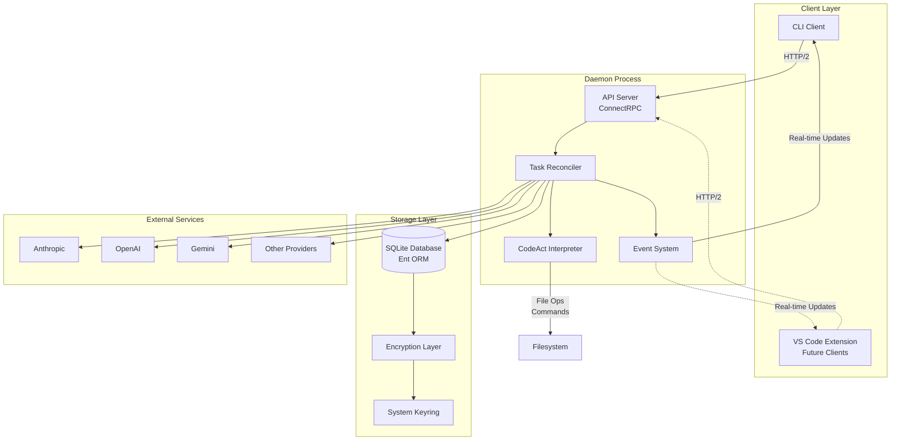
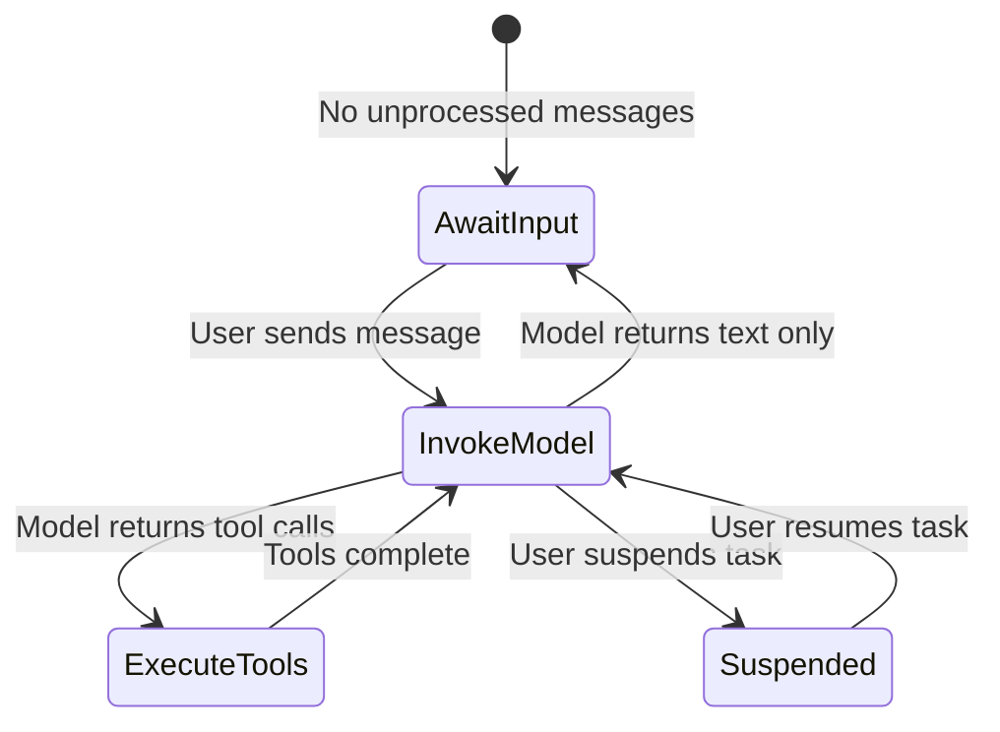
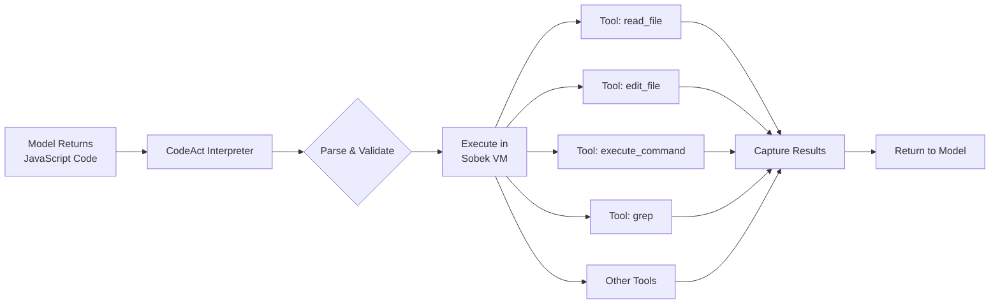
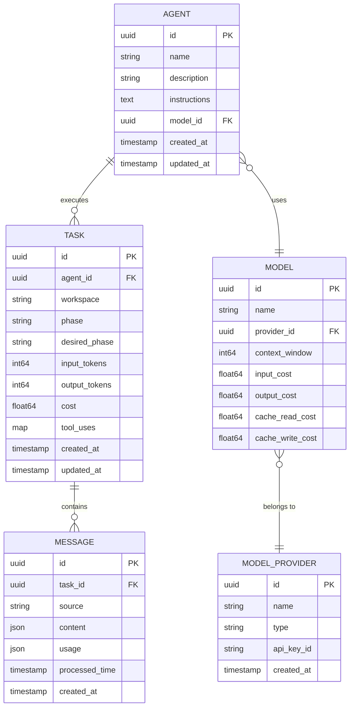
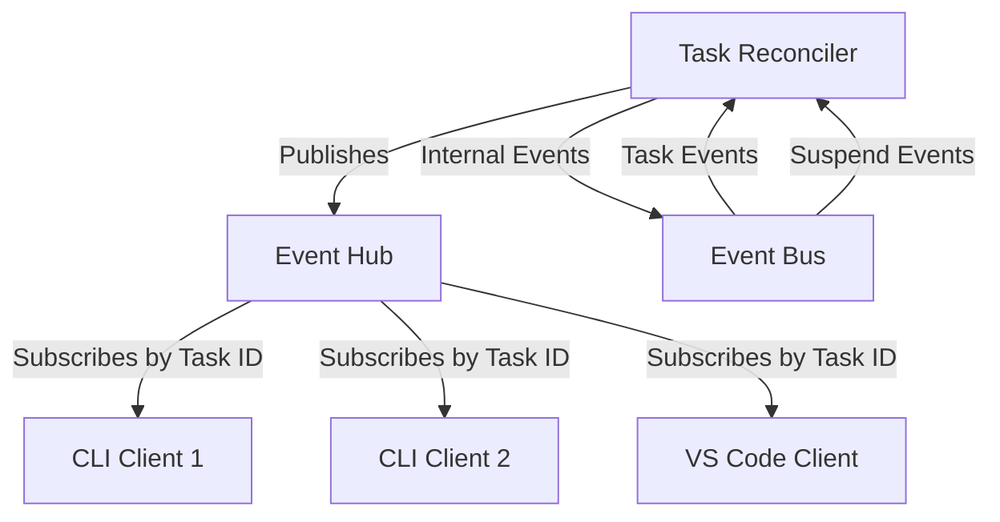
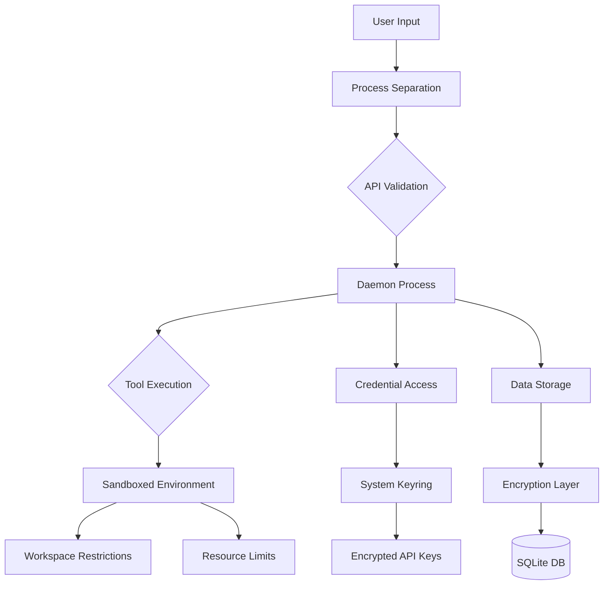
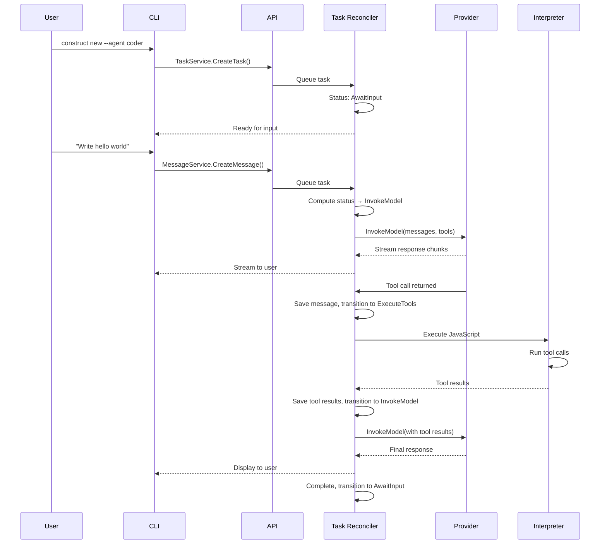
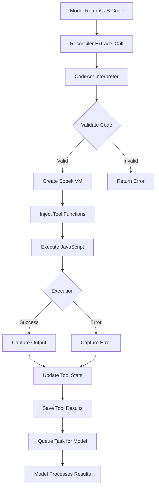

# Construct Architecture

Construct is an API-first, multi-agent coding assistant designed for superior tool calling performance through its CodeAct execution model. This document provides a comprehensive technical overview of the system's architecture, core components, and design decisions.

## Table of Contents

- [System Overview](#system-overview)
- [Core Architecture](#core-architecture)
- [Component Deep Dive](#component-deep-dive)
- [Data Flow](#data-flow)
- [Security Architecture](#security-architecture)
- [Technology Stack](#technology-stack)
- [Design Principles](#design-principles)
- [Architectural Decisions](#architectural-decisions)

## System Overview

Construct follows a client-server architecture with a daemon-based backend and pluggable frontends. The system is designed to be API-first, meaning every operation is available through the API before any UI is built.



### High-Level Flow

1. **Client** sends API requests over HTTP/2 (ConnectRPC)
2. **API Layer** validates and routes requests
3. **Task Reconciler** orchestrates the conversation flow
4. **Model Providers** generate responses
5. **CodeAct Interpreter** executes tool calls
6. **Event System** streams updates back to clients
7. **Storage** persists all state in SQLite

## Core Architecture

### Daemon-Based Design

Construct runs as a user-space daemon with socket activation:

**Benefits:**
- **Fast startup**: Daemon starts on first use, not at boot
- **Persistent state**: Stays running between requests
- **Resource efficiency**: Only runs when needed
- **Client independence**: Any client can connect via API
- **Security isolation**: Credentials live only in daemon process

**Platform Integration:**
- **Linux**: systemd user service with socket activation
- **macOS**: launchd LaunchAgent with socket activation

### API-First Architecture

Every operation is exposed through a well-defined API before any UI is built.

**API Services:**
- `AgentService` - Manage agent configurations
- `TaskService` - Manage conversation tasks
- `MessageService` - Handle messages
- `ModelService` - Configure AI models
- `ModelProviderService` - Manage provider credentials

**Communication:**
- **Protocol**: ConnectRPC (gRPC-like, HTTP/2-based)
- **Format**: Protocol Buffers for type safety
- **Transport**: HTTP/2 for efficiency
- **Streaming**: Server-sent events for real-time updates

### Multi-Client Support

The architecture is client-agnostic. Any client can connect via the API:

- **CLI**: Current reference implementation (terminal-based)
- **VS Code Extension**: Experimental, under development
- **Custom Clients**: Anyone can build clients using the API

Clients only handle presentation - all logic lives in the daemon.

## Component Deep Dive

### Task Reconciler: The Heart of Construct

The Task Reconciler is the central orchestration engine that processes conversations. It's implemented as a work queue with concurrent workers.



**Reconciliation Loop:**

1. **Compute Task Status**
   - Analyzes message history
   - Determines current phase (AwaitInput, InvokeModel, ExecuteTools, Suspended)
   - Identifies next unprocessed message

2. **Phase: InvokeModel**
   - Builds message history for context
   - Assembles system prompt with environment info
   - Calls model provider with tools
   - Streams response chunks to client in real-time
   - Persists response and usage statistics
   - If tool calls present → transitions to ExecuteTools
   - If text only → marks complete, returns to AwaitInput

3. **Phase: ExecuteTools**
   - Extracts tool calls from assistant message
   - Executes via CodeAct interpreter (JavaScript)
   - Captures output, errors, and statistics
   - Persists tool results as system message
   - Returns to InvokeModel to continue conversation

4. **Phase: AwaitInput**
   - Idle state waiting for user input
   - No processing occurs

5. **Phase: Suspended**
   - User explicitly paused the task
   - Cancels any in-flight model invocations
   - Waits for resume signal

**Concurrency:**
- Configurable worker pool (default: 50 concurrent tasks)
- Each task processes independently
- Work queue ensures tasks are processed in order
- Graceful shutdown with 5-second drain timeout

**Error Handling:**
- Retryable errors (rate limits) → re-queue with backoff
- Provider errors → published to client
- Tool execution errors → captured and sent to model for recovery

### CodeAct Tool Calling System

Construct uses **CodeAct** - a JavaScript-based tool execution model that provides superior flexibility over traditional structured tool calls.



**How It Works:**

1. **Model generates JavaScript code** that calls tools as functions
2. **Interpreter validates** the code structure
3. **Sobek VM executes** JavaScript in isolated environment
4. **Tools are injected** as global functions in the VM
5. **Results are captured** and returned to the model

**Built-in Tools:**
- `read_file(path, start_line, end_line)` - Read file contents
- `create_file(path, content)` - Create or overwrite file
- `edit_file(path, diffs)` - Apply targeted edits
- `list_files(path, recursive)` - List directory contents
- `grep(query, path, options)` - Fast regex search
- `find_file(pattern, path)` - Find files by name pattern
- `execute_command(command)` - Execute shell commands
- `print(value)` - Debug output visible only to model

**Advantages over Traditional Tool Calling:**
- **More flexible**: Can use loops, conditionals, variables
- **Fewer round trips**: Process multiple files in one call
- **Better error handling**: Try/catch blocks in code
- **Clearer intent**: Code shows exactly what will happen
- **Easier debugging**: JavaScript is human-readable

**Security:**
- JavaScript execution sandboxed in Sobek VM
- No access to Node.js modules or `require()`
- Filesystem access limited to workspace directory
- Command execution can be restricted
- Resource limits enforced (timeouts, memory)

### Model Provider System

Construct abstracts multiple AI providers behind a common interface, enabling seamless switching and redundancy.

**Supported Providers:**
- **Anthropic** - Claude models (Sonnet, Opus, Haiku)
- **OpenAI** - GPT models (GPT-4, GPT-4o, o1)
- **Google** - Gemini models
- **xAI** - Grok models
- **DeepSeek** - Cost-effective alternatives
- **AWS Bedrock** - Enterprise access (future)

**Provider Abstraction:**

```go
type ModelProvider interface {
    InvokeModel(ctx context.Context, 
                model string, 
                prompt string, 
                messages []*Message, 
                opts ...InvokeModelOption) (*Message, error)
}
```

All providers implement this interface, allowing:
- **Transparent switching** between providers
- **Unified error handling** and retry logic
- **Consistent streaming** across all providers
- **Provider-specific optimizations** hidden from caller

**Resilience Features:**
- **Exponential backoff** for rate limits (1s → 10s max)
- **Circuit breaker** pattern (5 failures → 10s cooldown)
- **Automatic retries** for transient failures
- **Timeout handling** per provider

**Cost Tracking:**
- Token usage (input, output, cache reads, cache writes)
- Per-model pricing (stored in database)
- Calculated cost per message
- Aggregated cost per task

### Storage Layer

Construct uses SQLite with Ent ORM for type-safe database operations.

**Schema Overview:**



**Key Entities:**

- **Agent**: AI agent configuration (prompt, model assignment)
- **Task**: Conversation/work unit with resource tracking
- **Message**: Individual messages in conversation (user, assistant, system)
- **Model**: AI model configuration (costs, context window)
- **ModelProvider**: Provider credentials and configuration

**Message Content Structure:**

Messages use a flexible block-based content structure:

```json
{
  "blocks": [
    {
      "kind": "text",
      "payload": "Hello, world!"
    },
    {
      "kind": "code_interpreter_call",
      "payload": "{\"id\": \"call_123\", \"args\": {...}}"
    },
    {
      "kind": "code_interpreter_result",
      "payload": "{\"output\": \"...\", \"error\": \"\"}"
    }
  ]
}
```

Block types:
- `text` - Plain text content
- `code_interpreter_call` - Tool call block
- `code_interpreter_result` - Tool execution result
- `native_tool_call` - Direct tool call (future)
- `native_tool_result` - Direct tool result (future)

**Why SQLite:**
- Zero configuration (no server to manage)
- Single file storage (~/.construct/construct.db)
- Fast for typical workloads (single user, local access)
- WAL mode for better concurrency
- Good enough for 99% of use cases

**Limitations:**
- Not suitable for high-concurrency writes
- Not designed for distributed deployments
- No built-in replication

For these cases, Ent's ORM abstraction allows swapping to PostgreSQL.

### Event System

The event system provides real-time updates to connected clients.

**Architecture:**



**Event Types:**

1. **Message Events** - Streaming message content
   - Partial text chunks (streaming response)
   - Complete messages
   - Tool calls
   - Tool results
   - Errors

2. **Task Events** - Task state changes
   - Phase transitions (InvokeModel → ExecuteTools)
   - Completion
   - Suspension

**Streaming Model:**

- Clients subscribe to task by ID
- Server sends events as Protocol Buffer messages
- HTTP/2 streaming for efficient delivery
- Multiple clients can subscribe to same task
- Events published only to relevant task subscribers

**Internal Event Bus:**

Used for coordination within the daemon:
- Task Reconciler publishes task events to trigger re-processing
- Suspend events cancel in-flight operations
- Enables loose coupling between components

### Security Architecture

Construct implements defense-in-depth with multiple security layers.



**Layer 1: Process Separation**
- CLI and daemon are separate processes
- Credentials never in CLI process
- Communication only via API

**Layer 2: Dual-Layer Credential Protection**

Construct uses two layers for credential security:

1. **System Keyring** (Primary)
   - API keys stored in OS keyring (Keychain on macOS, Secret Service on Linux)
   - OS-level encryption and access control
   - Requires user authentication to access
   - Keys never written to disk in plaintext

2. **Encryption Layer** (Secondary)
   - Additional encryption for data at rest in SQLite
   - Uses Tink cryptography library
   - Master encryption key stored in system keyring
   - Protects sensitive data even if database file is copied

**How They Work Together:**
```
User creates provider
    ↓
CLI → Daemon API
    ↓
Daemon stores API key in system keyring (encrypted by OS)
    ↓
Daemon stores key ID reference in SQLite
    ↓
When needed: Retrieve key from keyring → Use for provider auth
```

**Layer 3: Tool Execution Sandboxing**

- **Filesystem**: Access restricted to workspace directory only
- **Commands**: Execute in isolated environment
- **Network**: Limited or disabled (configurable)
- **Resources**: CPU, memory, and time limits enforced

**Sandboxing Implementation:**
- **Linux**: Uses systemd-run for namespace isolation
- **macOS**: Process isolation with directory restrictions
- **All platforms**: Timeout enforcement, resource limits

**Layer 4: Permissions (Future)**
- Fine-grained tool access control per agent
- Explicit allow lists for tools
- Audit logging of tool executions

## Data Flow

### Creating an Agent

Simple CRUD operation:

```
User: construct agent create coder --model claude-sonnet-4 --prompt "..."
    ↓
CLI → AgentService.CreateAgent()
    ↓
API validates inputs (prompt length, model exists)
    ↓
Save to database (agents table)
    ↓
Return agent to CLI
    ↓
CLI displays confirmation
```

### Starting a Conversation



### Message Processing Lifecycle

Every message goes through a processing lifecycle tracked by timestamps:

1. **Created** (`created_at`)
   - Message saved to database
   - `processed_time` is NULL
   - Task Reconciler queued

2. **Processing**
   - Reconciler picks up unprocessed message
   - For user messages → invoke model
   - For assistant messages → execute tools

3. **Processed** (`processed_time` set)
   - Model invocation complete or tools executed
   - Timestamp recorded
   - Next message becomes active

4. **Complete**
   - All messages processed
   - Task returns to AwaitInput phase

### Tool Execution Flow



**Tool Statistics:**
- Each task tracks tool usage counts
- Updated after every tool execution
- Persisted in task record: `{"read_file": 5, "edit_file": 3}`
- Used for analytics and debugging

### Resuming a Task

```
User: construct resume --last
    ↓
CLI → TaskService.ListTasks(limit=1, order=desc)
    ↓
API queries most recent task
    ↓
CLI → TaskService.Subscribe(task_id)
    ↓
If task in AwaitInput → ready for user message
If task in InvokeModel/ExecuteTools → continue from where it left off
    ↓
User sends messages, conversation continues
```

**Task Resume Capabilities:**
- Full conversation history preserved
- Can switch agents mid-conversation
- Workspace directory remembered
- Resource usage (tokens, cost) tracked

## Design Principles

### 1. API-First

Everything accessible via API before building UI:
- **CLI is just one client** - not the primary interface
- **Custom tooling** easy to build
- **Automation-friendly** for CI/CD integration
- **Language-agnostic** - build clients in any language

### 2. Client-Agnostic

The daemon doesn't care what connects to it:
- **CLI**: Current reference implementation
- **VS Code Extension**: In development
- **Custom dashboards**: Track agent activity
- **CI/CD integrations**: Automated code review

### 3. Security by Default

Multiple isolation layers:
- **Process separation** between CLI and daemon
- **Sandboxed execution** for tools
- **Dual-layer credential protection** (keyring + encryption)
- **Workspace restrictions** for filesystem access

### 4. Separation of Concerns

Clear boundaries between components:
- **CLI**: User interaction and presentation only
- **Daemon**: All business logic and state management
- **Providers**: AI model communication
- **Storage**: Data persistence

### 5. Production Ready

Built for real-world use:
- **Structured logging** with context
- **Metrics** (Prometheus-compatible)
- **Robust error handling** and retries
- **Graceful degradation** on failures
- **Resource tracking** (tokens, cost, time)
- **Analytics** for product improvement (PostHog)

### 6. Cross-Platform

Native integration with platform features:
- **System service management** (systemd, launchd)
- **Socket activation** for automatic startup
- **Credential storage** (OS keyring)
- **Sandboxing** (systemd-run, process isolation)

## Technology Stack

### Backend

- **Language**: Go 1.24+
  - Fast compilation and execution
  - Excellent concurrency with goroutines
  - Strong typing and error handling
  - Great cross-platform support

- **API Framework**: ConnectRPC
  - Protocol Buffers for type-safe contracts
  - HTTP/2 transport for efficiency
  - Streaming support for real-time updates
  - Language-agnostic (clients in any language)

- **Database**: SQLite 3 + Ent ORM
  - Embedded database (no setup required)
  - Type-safe, generated Go code
  - Automatic schema migrations
  - Fast for single-user workloads

- **JavaScript Runtime**: Sobek (Goja fork)
  - Pure Go implementation of ECMAScript 5.1
  - No CGo dependencies
  - Sandboxed execution
  - Good performance for tool calling

### Frontend

- **CLI Framework**: Cobra + Bubbletea
  - Cobra: Command structure and argument parsing
  - Bubbletea: Rich terminal UI, event-driven
  - Composable components
  - Cross-platform terminal support

### Infrastructure

- **Service Management**:
  - systemd (Linux)
  - launchd (macOS)

- **Metrics**: Prometheus client library

- **Analytics**: PostHog for product insights

- **Cryptography**: Tink for encryption at rest

- **Keyring**: go-keyring for OS credential storage

## Architectural Decisions

### Why Daemon/CLI Split?

**Alternative**: Single binary that does everything

**Chosen**: Separate daemon and CLI

**Reasons**:
- **Security**: Credentials isolated in daemon process
- **Flexibility**: Replace CLI with custom clients
- **Efficiency**: Daemon stays warm, CLI is fast to start
- **Production-ready**: Daemon can restart, has logging, metrics
- **Multi-client**: Multiple clients can connect simultaneously

**Tradeoff**: More complex deployment (daemon installation required)

### Why SQLite?

**Alternative**: PostgreSQL or MySQL

**Chosen**: SQLite

**Reasons**:
- **Zero configuration**: No server to install or manage
- **Single file**: Easy backup, migration, debugging
- **No dependencies**: Simplifies installation
- **Fast enough**: Single user, local access pattern
- **Good enough**: 99% of use cases don't need distributed database

**Tradeoff**: Not suitable for high-concurrency writes or distributed deployments

**Future**: Ent ORM allows migrating to PostgreSQL if needed

### Why Multi-Agent?

**Alternative**: Single do-everything agent

**Chosen**: Multiple specialized agents

**Reasons**:
- **Cost optimization**: Use cheaper models for simple tasks
- **Speed**: Fast models for quick operations
- **Quality**: Smart models where accuracy matters
- **Specialization**: Agents focus on specific roles (planning, coding, reviewing)
- **Flexibility**: Users control which agent handles each task

**Tradeoff**: Initial complexity (users must choose agents)

**Mitigation**: Sensible defaults (edit agent for most tasks)

### Why Multi-Provider?

**Alternative**: Single provider (simpler)

**Chosen**: Multiple providers

**Reasons**:
- **No vendor lock-in**: Switch providers anytime
- **Cost optimization**: Use cheapest provider for task
- **Reliability**: Fallback if provider has outage
- **Model specialization**: Different models for different strengths
- **User choice**: Flexibility in model selection

**Tradeoff**: More code to maintain, more testing required

**Benefit**: Outweighs complexity for production use

### Why CodeAct (JavaScript) Instead of Structured Tools?

**Alternative**: Traditional structured tool calling (JSON schemas)

**Chosen**: CodeAct with JavaScript

**Reasons**:
- **More flexible**: Loops, conditionals, variables, complex logic
- **Fewer round trips**: Process multiple files in single execution
- **Better error handling**: Try/catch in user code
- **Clearer intent**: Code shows exactly what will happen
- **Easier debugging**: JavaScript is human-readable
- **Proven approach**: Used by other successful coding assistants

**Tradeoff**: More complex execution (need JS runtime, sandboxing)

**Safety**: Sobek VM provides isolation, only allowed tools available

### Why Task-Based Instead of Session-Based?

**Alternative**: Sessions that disappear after CLI exits

**Chosen**: Persistent tasks

**Reasons**:
- **Resume anywhere**: Continue conversations later
- **Agent switching**: Change agents mid-conversation
- **Resource tracking**: Track token usage, cost per task
- **History**: Review past conversations
- **Multi-client**: Multiple clients can join same task

**Tradeoff**: More database storage

**Benefit**: Essential for real-world workflows

---

## Conclusion

Construct's architecture is designed for production use with a focus on security, flexibility, and developer experience. The daemon-based design with API-first approach enables building custom clients and integrations, while the CodeAct tool calling system provides superior performance for code generation tasks.

The Task Reconciler's reconciliation loop is the heart of the system, orchestrating the complex dance between user input, model invocations, and tool executions. The dual-layer security approach (system keyring + encryption) ensures credentials are always protected, while the sandboxed tool execution prevents unintended consequences.

By supporting multiple AI providers and using a persistent task model, Construct gives users full control over their coding assistant while maintaining state across sessions. The architecture is proven, production-ready, and designed to scale from individual developers to team environments.
